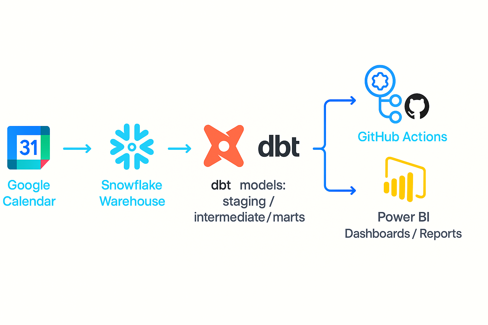

# Google Calendar Analytics Pipeline (dbt + Snowflake + GitHub Actions)

A complete end-to-end analytics engineering project built with **dbt**, **Snowflake**, and **GitHub Actions**.  
The pipeline transforms raw Google Calendar event & attendee data into structured analytical marts
for reporting, automation, and trend analysis.

---

## Architecture Overview

<p align="center">
  
</p>

This diagram shows the full analytics pipeline:

- **Google Calendar** — source of events and attendees  
- **Fivetran / ingestion layer** — automated data loading into Snowflake (optionally)
- **Snowflake** — cloud data warehouse (raw + staging + analytics schemas)  
- **dbt Core** — transformations (staging → intermediate → marts), tests, documentation  
- **GitHub Actions** — CI/CD orchestration for scheduled dbt runs  

---

## Project Overview

This project demonstrates a **production-ready data transformation workflow**, including:

- dbt for SQL modeling, testing & documentation  
- Snowflake as a cloud data warehouse  
- GitHub Actions for automated nightly builds  
- Google Calendar API as the raw data source  
- Multi-layer dbt architecture (staging → intermediate → marts)  

The pipeline extracts raw events & attendee metadata and turns them into insights such as:

- Daily & weekly event distributions  
- Number of attendees per event  
- Attendee status trends  
- Calendar usage patterns  
- Event-level analytical mart for reporting  

[Project artifacts](/artifacts.md)
---

## Dataset

The project uses exported data from the **Google Calendar API**, loaded into Snowflake via external tools.

### **Source tables (raw → staging):**

- `STG_EVENTS`
Contains event metadata such as title, start/end timestamps, description, event status, and calendar ID.

- `STG_ATTENDEE`
Contains attendee-level data: email, status, organizer flag, optional flags, etc.

- `STG_CALENDAR_LIST`
Contains metadata about user's calendars (name, color, visibility).

---

## Project Structure (dbt)

```text
google_calendar_project/
│
├── models/
│   ├── staging/
│   │   ├── stg_events.sql
│   │   ├── stg_attendee.sql
│   │   └── stg_calendar_list.sql
│   │
│   ├── intermediate/
│   │   └── int_events_with_attendees.sql
│   │
│   ├── marts/
│   │   ├── attendees_status_summary.sql
│   │   ├── calendar_events_summary.sql
│   │   ├── events_daily_weekly_summary.sql
│   │   └── schema.yml
│   │
│   └── sources/
│       └── google_calendar_sources.yml
│
├── logs/
├── target/
└── README.md
```
---

## CI/CD Overview

Automated CI/CD process powered by **GitHub Actions**, used to run dbt transformations,
validate data quality, and deploy analytics models to **Snowflake** on a daily schedule.

## Workflow Summary
- Installs dbt runtime and dependencies  
- Generates `profiles.yml` securely using GitHub Secrets  
- Runs `dbt deps`  
- Runs `dbt build` (models + tests)  
- Publishes transformed datasets to Snowflake  
- Ensures reliability, observability, and automation across all pipeline layers  

## Schedule
| Trigger | Value |
|--------|--------|
| Manual trigger | ✔️ |
| Daily cron | `0 4 * * *` (04:00 UTC) |

## Purpose
Ensures consistent data freshness, test validation, and production-ready
automation for the analytics workflow.

---


## Data Tests

The project uses **dbt native tests** and **custom logic** to ensure data consistency across staging,
intermediate layers, and marts.

## Built-in Tests
- `not_null`
- `unique`
- `relationships`

## Custom Tests
- Grain validation for event-attendee models  
- Business-rule tests for summary marts  

## Location
``models/marts/schema.yml``

## Purpose
Guarantees correctness and reliability of every transformed dataset before
publishing analytics marts.

---

## Roadmap
- Incremental history for events & attendees   
- Visualization dashboards in Snowflake  
- Automated anomaly-detection alerts in the pipeline  

## Vision
Build a scalable, production-grade analytics ecosystem around Google Calendar data.

---

## Project Status

- CI workflow history was cleaned up after stabilizing the pipeline.
- The workflow is kept as a reproducible, manual-run portfolio artifact.|

