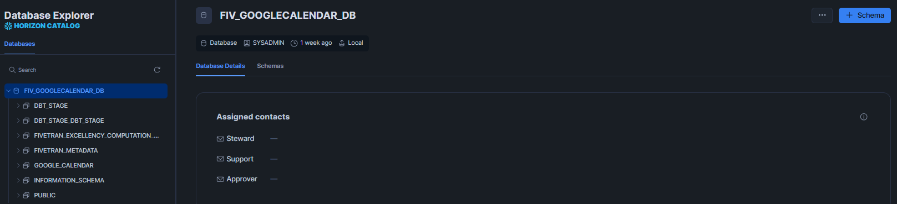
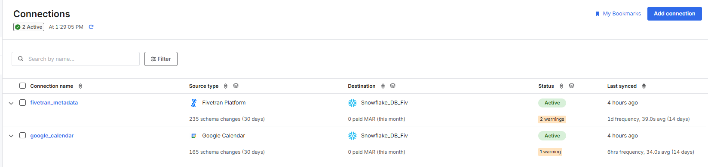
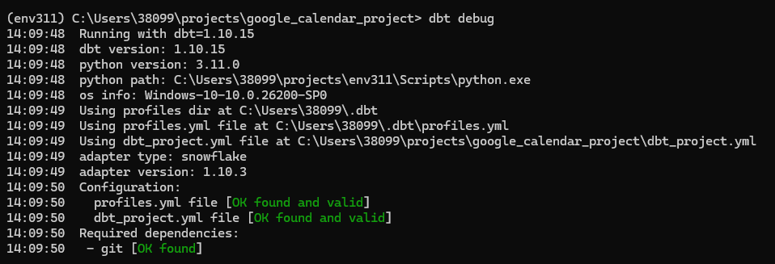
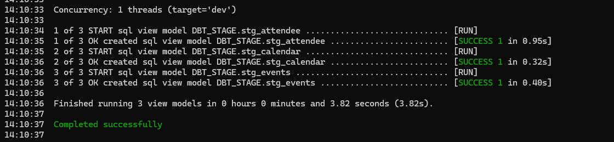
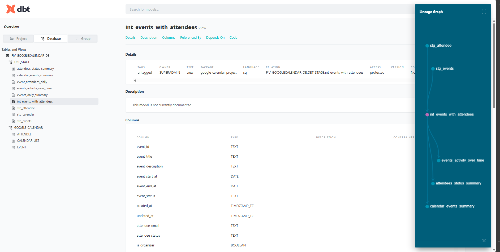
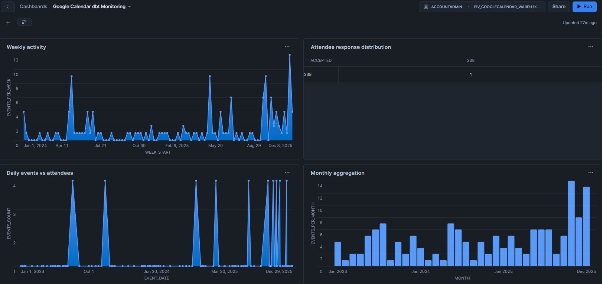
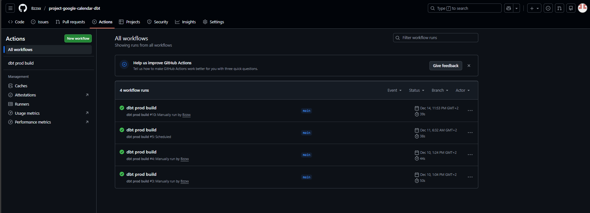

# 📂 Project Artifacts

# 1. Data Generation

- Registered Fivetran account and connected Snowflake as destination

---

# 2. Storage

- Created Snowflake account with user, role, and warehouse
- Granted necessary access permissions

  

---

# 3. Ingestion

- Configured Google Calendar connector in Fivetran
- Established automated sync to Snowflake (every 6 hours)
  

  

---

# 4. Transformation

- Installed dbt Core and initialized project
- Configured Snowflake connection in profiles.yml

  

  

# Created three-layer dbt architecture:

- Staging: Raw source data models
- Intermediate: Business logic transformations
- Marts: Final analytical models

---

- Implemented data quality tests with dbt test
  

  

- Generated documentation and lineage graphs

  

---

# Serving in Snowflake Dashboard

  

  

---

🔗[Back to Main Project](/README.md)
